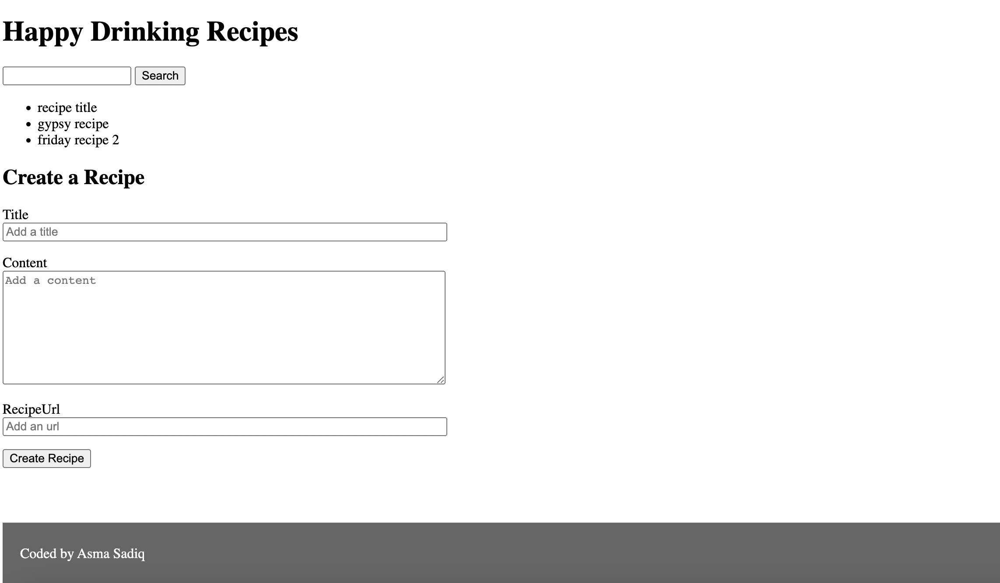

# happy-recipes-project

## Steps to start the application

### you need to install

#### NPM

#### Node.js

### Start the app

#### npm install

#### npm start

#### Open index.html file

#### The application should look like this:

<!-- #### After you click on recipe title,the application will look like this:

 -->
